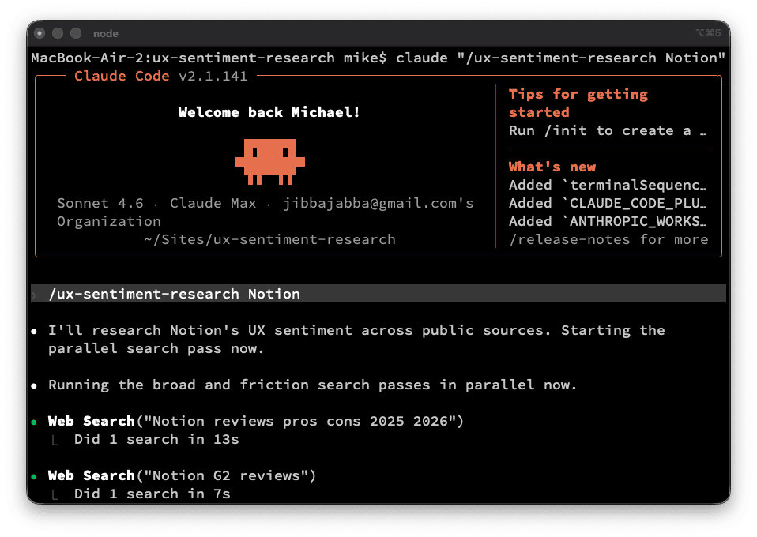

# UX Sentiment Research — a Claude skill

A reusable Claude skill that pulls real UX sentiment about any company's product, identifies friction patterns, and produces interview-ready talking points and questions. Designed for product and design interview prep. Also works for competitive analysis and product critique writing.

Run it as a slash command in Claude Code or as an uploaded skill in Claude.ai. Pass any company name and it works the same way:

```
/ux-sentiment-research Notion
```



## What you get

The skill produces three artifacts in a single pass:

1. **A friction pattern list** with verbatim user quotes from G2, Capterra, App Stores, Reddit, YouTube, and targeted Google searches
2. **Two or three concrete improvement ideas** framed as discussion starters, not critiques
3. **Three to five sharp questions** that show you did real research, not LinkedIn-skim research

See [`examples/notion-output.md`](examples/notion-output.md) for a real worked example.

The whole pass takes about 30 minutes the first time you run it and around 10 minutes once you know what to expect.

## Why this exists

Walking into a design interview and asking "what are your biggest UX challenges?" tells the hiring manager three things: you didn't use the product, you don't have your own opinions yet, and you expect them to do the work of framing the conversation. That's how 90% of candidates show up.

Real product research used to take a full day, which is why most candidates skipped it. With Claude doing search and synthesis in parallel, the same work compresses into about 30 minutes. There's no longer an excuse not to do it.

This skill packages the workflow so you don't have to rebuild it every time.

## Install

### Claude Code (recommended)

Clone the repo directly into your personal skills directory:

```bash
git clone https://github.com/jibbajabba/ux-sentiment-research.git ~/.claude/skills/ux-sentiment-research
```

That's it. The repo root is the skill folder. Open Claude Code and run:

```
/ux-sentiment-research <company name or URL>
```

To update later, pull from the repo:

```bash
cd ~/.claude/skills/ux-sentiment-research
git pull
```

For a project-only install (skill is only available in one repo), use `.claude/skills/` inside that project instead of `~/.claude/skills/`.

### Claude.ai

1. Download this repo as a ZIP (the green Code button on GitHub, then Download ZIP)
2. Open Claude.ai → Settings → Capabilities → Skills
3. Make sure Code Execution and File Creation is enabled
4. Upload the ZIP
5. Toggle the skill on

### Manual (any Claude environment)

Open `SKILL.md` and paste the contents at the top of a new conversation. Then say "follow this workflow to research [company]." Works in any Claude chat, no install required.

## How it works

The skill runs a seven-step workflow:

1. **Confirm scope** — product, category, mobile or not, output framing
2. **Broad search pass** — G2, Capterra, App Store, Reddit, alternatives
3. **Friction search pass** — targeted negative-sentiment queries
4. **Read the marketing** — last, not first, so the gap stands out
5. **Pattern-match the friction** — group complaints into categories
6. **Generate improvements and questions** — concrete, not generic
7. **Package and write** — under 1,500 words

The methodology is in [`SKILL.md`](SKILL.md). The supporting files are:

- [`references/sources-by-company-type.md`](references/sources-by-company-type.md) — Which sources matter for B2B SaaS vs consumer mobile vs developer tools vs civic tech
- [`references/query-patterns.md`](references/query-patterns.md) — Specific search patterns that surface real friction instead of marketing fluff
- [`references/output-template.md`](references/output-template.md) — The exact output structure to fill in
- [`examples/notion-output.md`](examples/notion-output.md) — A real worked example on Notion

## Customize it

The skill isn't write-once. After running it on a few companies you'll notice where the methodology breaks for your situation. Edit the files. The output template, source matrix, and query patterns are separate files specifically so you can tune them without rewriting the main skill.

Common customizations people make:

- Adding industry-specific review sites (KLAS for healthcare, AlternativeTo for software discovery)
- Tightening the time budget for known categories
- Changing the output format for specific use cases (case study vs interview prep vs investor due diligence)
- Adjusting the trigger description so it matches your particular phrasing habits

If you make a change that you think others would benefit from, open a pull request.

## What this is not

- Not a scraper. The skill uses Claude's web search; it doesn't bypass anti-bot protection on review sites.
- Not for pre-launch products. If there's no public review surface, the skill has nothing to work with.
- Not a substitute for using the product. If you can get a free trial or watch a demo video, do that too.
- Not a one-shot prompt. The methodology assumes you stay in the loop, read intermediate results, and steer the pattern matching.

## Companion writing

The methodology is documented in long form at [pairwithclaude.com](https://pairwithclaude.com). The post "How to research a company's UX in 30 minutes before your next interview" walks through the workflow with Notion as the worked example.

## License

MIT. See [`LICENSE`](LICENSE).

## Credits

Built by [Michael Angeles](https://michaelangeles.com). Part of an ongoing series at [pairwithclaude.com](https://pairwithclaude.com) about working with Claude as a real collaborator, not a magic answer machine.

If you use this skill and it helps, tell me how it went. Open an issue, comment on the post, or message me on [LinkedIn](https://www.linkedin.com/in/michaelangeles).
